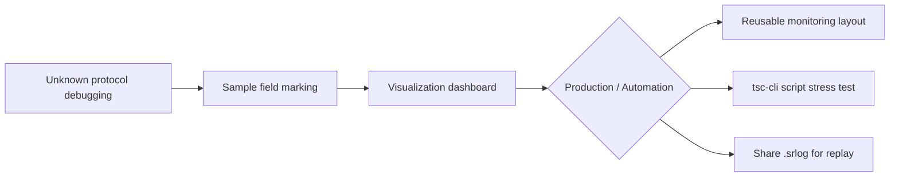

<div align="center">

# TechSync

**Select log fields. See waveforms instantly.**

Embedded systems · Industrial debugging · Cross-platform desktop tool

<br />

<p>
  
  <a href="https://github.com/WeCanSTU/TechSync">
    
  </a>
  <a href="https://github.com/WeCanSTU/TechSync/issues">
    
  </a>
</p>
<p>
  
  
  
</p>

<br />


<br />

[Official Website](https://www.umetav.cn/en/products/techsync)

</div>

---

## Overview

**TechSync** brings serial communication, sample-based data visualization, and the **tsc-cli** command-line tool into one unified workflow. Use the GUI to inspect logs and waveforms while terminal scripts send commands through the same serial port.

If a classic serial terminal is a console with a send box, TechSync is closer to a complete debugging loop that is **reproducible, shareable, and production-ready**.

| | Traditional Serial Tools | TechSync |
|---|---|---|
| Protocol parsing | Manual offsets or device-specific plugins | **Select fields directly from real logs** |
| GUI and scripts | Compete for the same serial port | **GUI + tsc-cli shared session** |
| Logs | Copy the current window | **Capture, archive, replay, and live logging** |
| Thresholds | Manual monitoring | **Conditional markers + automated actions** |
| No hardware | UI debugging is blocked | **Offline loopback, simulated data, and log replay** |
| Firmware flashing | Separate tools required | **Scriptable DFU / flash with tsc-cli** |

---

## Interface Preview

<table>
<tr>
<td align="center" width="50%">
<br />
<b>Serial Assistant</b><br />
Send/receive · Sequences · Log replay
</td>
<td align="center" width="50%">
<br />
<b>Data Visualization</b><br />
Waveforms · Gauges · 3D attitude
</td>
</tr>
<tr>
<td align="center">
<br />
<b>Toolbox</b><br />
Device connection · Module setup · Firmware upgrade
</td>
<td align="center">
<br />
<b>GUI + tsc-cli</b><br />
Visual monitoring and terminal automation
</td>
</tr>
</table>

---

## Core Capabilities

### 1. Serial Assistant: More Than Send And Receive

TechSync covers full serial parameters, reconnect handling, multiple windows, log replay, and live logging for long-running tests.

<table>
<tr>
<td width="55%">

- String / hex send and receive, timed sending, and **multi-command sequences**
- Log search and dual export formats: `.txt` and replayable `.srlog`
- **Live file logging** while connected, so long tests do not depend on UI buffers
- Multiple serial windows, offline loopback, and parameter memory
- One-click equivalent **tsc-cli** command generation inside the GUI

</td>
<td width="45%" align="center">
<br />
<sub>Reconnect automatically after unplug and replug</sub>
</td>
</tr>
<tr>
<td align="center">
<br />
<sub>Replay .srlog files with original timing</sub>
</td>
<td>

**Complete Log Lifecycle**

| Format | Purpose |
|------|------|
| `.txt` | Plain archive and data injection |
| `.srlog` | Timestamped replay logs for sharing |
| Live logging | Continuous file writing during connection |

</td>
</tr>
</table>

---

### 2. Data Visualization: No Code, Just Select

> Copy one sample log line -> select data fields with the mouse -> bind them to waveforms or gauges. No regular expressions required.

<table>
<tr>
<td width="50%">

**Four-step workflow**

1. Copy a sample line from the receive area, for example: `channels: 0.1,-0.2,-0.3, valid: 444`
2. Select `0.1`, `-0.3`, and `444` directly on the sample line
3. Assign data types and aliases, then bind them to waveforms or gauges
4. At runtime, TechSync extracts only the marked positions and ignores the rest

**Built-in widgets:** numeric value, gauge, vertical scale, multi-curve waveform, 3D attitude, threshold marker, and triggered actions

</td>
<td width="50%" align="center">

</td>
</tr>
</table>

- Multiple **data profiles** for different message formats
- Importable and exportable marker definitions
- Reusable layouts for production dashboards and team handoff
- **Conditional markers + actions**: send serial commands, call webhooks, or play alerts on threshold hits

---

### 3. tsc-cli: Use The Terminal While The GUI Is Connected

Installed with TechSync and available from the terminal:

```bash
# List serial ports
tsc-cli serial list

# Connect and interact with a port that can also be shared with the GUI
tsc-cli serial monitor --port COM3 --baudrate 115200 --write_enable

# Use with Aries Plus for DFU and firmware flashing
tsc-cli usb dfu --all
tsc-cli flash firmware.bin
```

**Typical hybrid workflows**

- Watch logs in the GUI while scripts send commands: `serial monitor --write_enable`
- Run automated stress tests while monitoring waveforms and alerts visually
- Keep the visualization window open and let tsc-cli traffic drive panel updates

> `serial monitor` works with standard system serial ports. USB management, DFU switching, and scriptable firmware flashing for other devices require the **Aries Plus debugger**.

---

## Eight Key Advantages

<table>
<tr>
<td width="25%" valign="top"><b>1. No-code protocol parsing</b><br/>Create field markers directly from real logs. Suitable for semi-structured and text-based messages.</td>
<td width="25%" valign="top"><b>2. Standalone visualization workspace</b><br/>Waveforms, gauges, values, and 3D attitude panels in reusable layouts.</td>
<td width="25%" valign="top"><b>3. Full log lifecycle</b><br/>Capture, archive, replay, and drive visualization from historical data.</td>
<td width="25%" valign="top"><b>4. GUI and CLI integration</b><br/>Built-in tsc-cli shares sessions with the graphical interface.</td>
</tr>
<tr>
<td valign="top"><b>5. Conditional actions</b><br/>Threshold hits can trigger commands, webhooks, external programs, or alerts.</td>
<td valign="top"><b>6. Debug without hardware</b><br/>Offline loopback, simulated data, and log replay help validate panels in advance.</td>
<td valign="top"><b>7. Unified device workflow</b><br/>Configure proprietary acceleration modules and manage firmware upgrades in one tool.</td>
<td valign="top"><b>8. Automation friendly</b><br/>Designed for production scripts, test workflows, and mixed human/script debugging.</td>
</tr>
</table>

---

## Compared With Classic Serial Assistants

| Capability | SSCOM / Friendly | SerialTool | **TechSync** |
|---|:---:|:---:|:---:|
| String / hex send and receive | Yes | Yes | Yes |
| Timed sending | Yes | Yes | Yes |
| Multi-command sequences | Partial | Partial | **Full** |
| Log export | Yes | Yes | Yes |
| Timed log replay | No | No | **Yes** |
| Live log archiving | No | No | **Yes** |
| Log search | Partial | Partial | Yes |
| Numeric / waveform monitoring | Partial | Partial | Yes |
| Drag-and-drop custom dashboard | No | No | **Yes** |
| 3D attitude visualization | No | No | **Yes** |
| Threshold alerts and actions | No | No | **Yes** |
| Offline debugging without hardware | No | No | **Yes** |
| CLI collaboration on the same port | No | No | **Yes** |
| CLI firmware flashing / DFU | No | No | **Yes** |
| Tool model | Lightweight | Lightweight | **GUI + CLI** |
| Cross-platform support | Partial | Yes | Yes |

---

## Typical Scenarios



| Scenario | Workflow |
|---|---|
| **Unknown protocol** | Receive logs -> mark sample fields -> watch waveforms and values |
| **AT initialization** | Use GUI sequences or interactive `tsc-cli --write_enable` |
| **Production monitoring** | Save a layout and use preview mode on monitoring screens |
| **Issue reproduction** | Export `.srlog` and replay the same timeline offline |
| **Scripted stress tests** | Run scripts while the GUI monitors alerts |
| **Pre-integration validation** | Use simulated data to validate 3D attitude and parsing |
| **Burn-in testing** | Live logging without relying on UI buffers |
| **Firmware flashing** | Use Aries Plus with `usb dfu` and `flash` scripts |
| **CI regression** | Send commands in pipelines and verify output |

---

## Supported Platforms

| Platform | Requirement | Installer |
|---|---|---|
| **Windows** | Windows 10 / 11 · x64 | `.exe` |
| **macOS** | macOS 12+ · Apple Silicon | `.dmg` |
| **Ubuntu** | Ubuntu 20.04+ · amd64 | `.deb` |

---

## Editions And Capabilities

| Capability | Trial | Basic | Standard / Pro |
|---|:---:|:---:|:---:|
| Serial send/receive, timed send, sequences | Yes | Yes | Yes |
| Live log writing | Yes | Yes | Yes |
| Log search and plain log export | No | Yes | Yes |
| Replay log export and log replay | No | No | Yes |
| Data visualization window | No | Limited | Full |
| Layout saving, conditional markers, and actions | No | No | Yes |
| tsc-cli command-line tool | Yes | Yes | Yes |

> tsc-cli itself is not separated by license level. Some GUI capabilities, such as replay log export, are still controlled by the activated edition.

---

## Product Modules

| Module | Designed For | What It Does |
|---|---|---|
| **Serial Assistant** | General serial debugging | Send/receive, logs, sequences, visualization entry |
| **Data Visualization** | Numeric, waveform, and attitude monitoring | Programmable dashboard with conditional actions |
| **tsc-cli** | Developers, testers, and production engineers | Scriptable serial workflows, DFU, and firmware flashing |
| **ACCELTRANS** | Proprietary module users | Configuration and 3D visualization for 6-axis / 9-axis acceleration modules |

> ACCELTRANS is intended only for TechSync proprietary acceleration modules.

---

## Download Trend

<div align="center">
<svg width="620" height="340" viewBox="0 0 620 340" xmlns="http://www.w3.org/2000/svg" role="img" aria-label="Hand-drawn chart of GitHub Releases cumulative downloads">
  <defs>
    <filter id="handdrawn-shadow-en" x="-20%" y="-20%" width="140%" height="140%">
      <feDropShadow dx="0" dy="10" stdDeviation="12" flood-color="#6b4e0a" flood-opacity="0.12"/>
    </filter>
  </defs>
  <rect x="24" y="18" width="572" height="298" rx="26" fill="#fffdf8" stroke="#eadfca" stroke-width="2" filter="url(#handdrawn-shadow-en)"/>
  <text x="310" y="56" text-anchor="middle" font-family="Kalam, Comic Sans MS, Bradley Hand, cursive" font-size="22" font-weight="700" fill="#6b4e0a">GitHub Releases Cumulative Downloads</text>
  <path d="M88 254 C86 215 91 174 88 136 C85 99 90 78 88 78" fill="none" stroke="#8a6a14" stroke-width="3" stroke-linecap="round"/>
  <path d="M86 254 C165 251 235 256 310 252 C389 249 459 254 532 252" fill="none" stroke="#8a6a14" stroke-width="3" stroke-linecap="round"/>
  <path d="M92 202 C208 199 310 205 532 200" fill="none" stroke="#e9dcc2" stroke-width="2" stroke-dasharray="8 10" stroke-linecap="round"/>
  <path d="M92 146 C218 143 335 149 532 144" fill="none" stroke="#e9dcc2" stroke-width="2" stroke-dasharray="8 10" stroke-linecap="round"/>
  <path d="M92 90 C220 88 352 93 532 89" fill="none" stroke="#e9dcc2" stroke-width="2" stroke-dasharray="8 10" stroke-linecap="round"/>
  <path d="M138 171 C190 142 237 113 292 102 C358 89 422 96 486 96" fill="none" stroke="#6b4e0a" stroke-width="5" stroke-linecap="round" stroke-linejoin="round"/>
  <path d="M138 173 C190 145 238 116 293 104 C357 92 422 98 486 98" fill="none" stroke="#d9b45f" stroke-width="2" stroke-linecap="round" stroke-linejoin="round" opacity="0.9"/>
  <g font-family="Kalam, Comic Sans MS, Bradley Hand, cursive" fill="#3a3024">
    <circle cx="138" cy="171" r="7" fill="#fff8e8" stroke="#6b4e0a" stroke-width="3"/>
    <text x="138" y="148" text-anchor="middle" font-size="17" font-weight="700">19</text>
    <circle cx="292" cy="102" r="7" fill="#fff8e8" stroke="#6b4e0a" stroke-width="3"/>
    <text x="292" y="80" text-anchor="middle" font-size="17" font-weight="700">31</text>
    <circle cx="486" cy="96" r="7" fill="#fff8e8" stroke="#6b4e0a" stroke-width="3"/>
    <text x="486" y="74" text-anchor="middle" font-size="17" font-weight="700">31</text>
    <text x="138" y="284" text-anchor="middle" font-size="14">2024-12-11</text>
    <text x="292" y="284" text-anchor="middle" font-size="14">2025-09-07</text>
    <text x="486" y="284" text-anchor="middle" font-size="14">2026-06-26</text>
    <text x="66" y="92" text-anchor="end" font-size="13">35</text>
    <text x="66" y="203" text-anchor="end" font-size="13">15</text>
  </g>
</svg>
</div>

---

## Contact

To learn more about **TechSync**, email [tech@umetav.cn](mailto:tech@umetav.cn).

**TechSync: Upgrade serial debugging from "reading logs" to a reproducible, automatable, and visual workflow.**

<div align="center">
<br />
<sub>More practical capabilities are continuously evolving.</sub>
</div>
