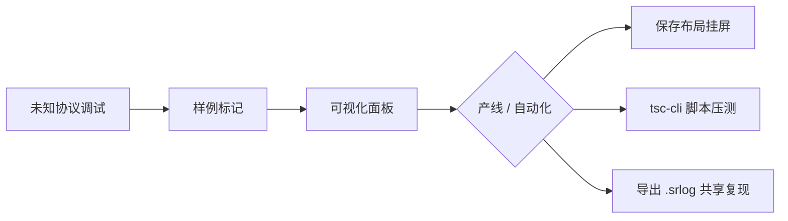

<div align="center">

# TechSync

**拖选日志，立刻看见波形**

嵌入式 · 工业调试 · 跨平台桌面工具

<br />

<p>
  
  <a href="https://github.com/WeCanSTU/TechSync">
    
  </a>
  <a href="https://github.com/WeCanSTU/TechSync/issues">
    
  </a>
</p>
<p>
  
  
  
</p>

<br />


<br />

[产品官网](https://www.umetav.cn/products/techsync)

</div>

---

## 简介

**TechSync** 将串口收发、样例选区可视化与 **tsc-cli** 命令行整合在同一套工具中。界面看日志与波形，终端脚本发指令，共享同一串口，多数传统串口助手做不到。

若经典串口助手是「带发送框的终端」，TechSync 更接近**可复现、可共享、可产线化**的完整调试闭环。

| | 传统串口工具 | TechSync |
|---|-------------|----------|
| 协议解析 | 手写偏移规则或安装插件 | **鼠标拖选日志即可标记字段** |
| 界面与脚本 | 争抢同一串口 | **GUI + tsc-cli 共享会话** |
| 日志 | 复制当前窗口 | **采集 · 归档 · 回放 · 实时写盘** |
| 超阈值 | 肉眼盯屏 | **条件标注 + 自动动作** |
| 无硬件 | 无法调试 UI | **离线回环 + 模拟数据 + 日志回放** |
| 烧录 | 另找专用工具 | **tsc-cli 脚本化 DFU / flash** |

---

## 界面一览

<table>
<tr>
<td align="center" width="50%">
<br />
<b>串口助手</b><br />
收发 · 序列发送 · 日志回放
</td>
<td align="center" width="50%">
<br />
<b>数据可视化</b><br />
波形 · 仪表 · 3D 姿态
</td>
</tr>
<tr>
<td align="center">
<br />
<b>工具箱</b><br />
设备连接 · 模组配置 · 固件升级
</td>
<td align="center">
<br />
<b>GUI + tsc-cli</b><br />
界面与终端并行调试
</td>
</tr>
</table>

---

## 三大核心能力

### ① 串口助手：不止收发

完整串口参数、**拔线重连**、多窗并行，加上传统工具没有的日志回放与实时写盘归档。

<table>
<tr>
<td width="55%">

- 字符串 / 十六进制收发，定时发送、**多指令序列发送**
- 日志搜索、双格式导出（`.txt` / 可回放 `.srlog`）
- 连接期间**实时写盘**，长时间测试不怕丢数据
- 多串口并行、离线回环、参数自动记忆
- 串口助手内一键复制等效 **tsc-cli** 命令

</td>
<td width="45%" align="center">
<br />
<sub>拔线重连 · 插回自动恢复</sub>
</td>
</tr>
<tr>
<td align="center">
<br />
<sub>按原始时间间隔回放 .srlog</sub>
</td>
<td>

**日志全生命周期**

| 格式 | 用途 |
|------|------|
| `.txt` | 普通归档与回灌 |
| `.srlog` | 含时间戳，可离线回放共享 |
| 实时写盘 | 连接期间持续写入，不依赖界面缓冲 |

</td>
</tr>
</table>

---

### ② 数据可视化：零代码，拖选即监视

> 复制一行样例日志 → 鼠标拖选数据位置 → 绑定波形或仪表。无需手写正则。

<table>
<tr>
<td width="50%">

**四步上手**

1. 从接收区复制一行样例，例如：`channels: 0.1,-0.2,-0.3, valid: 444`
2. 在样例行上鼠标拖选 `0.1`、`-0.3`、`444`
3. 分别设为浮点数/整数，起别名，绑定到波形或仪表
4. 运行时只提取已标记位置，其余内容自动忽略

**内置控件：** 数值 · 仪表 · 竖直刻度 · 多曲线波形 · 3D 姿态 · 阈值标注 · 命中动作

</td>
<td width="50%" align="center">

</td>
</tr>
</table>

- 多套**数据模版**，适配不同报文格式，标记列表可导入/导出
- 布局可保存复用，适合产线挂屏与方案迁移
- **条件标注 + 自动动作**：超阈值可自动发指令、HTTP 上报、播放告警

---

### ③ tsc-cli：界面已连接，终端继续收发

随软件安装，终端即用：

```bash
# 列出串口
tsc-cli serial list

# 连接并交互收发，可与 GUI 共享同一端口
tsc-cli serial monitor --port COM3 --baudrate 115200 --write_enable

# 配合 Aries Plus 调试器进行 DFU 与固件烧录
tsc-cli usb dfu --all
tsc-cli flash firmware.bin
```

**典型协同场景**

- 界面看日志，脚本发指令：`serial monitor --write_enable`
- 自动化压测 + 人工监视：脚本循环发命令，界面同时看波形与告警
- 可视化窗口打开时，tsc-cli 收发同样驱动面板更新

> `serial monitor` 适用于系统识别的通用串口。对其他设备执行 USB 管理、DFU 切换与脚本化固件烧录，需配合 **Aries Plus 调试器**。

---

## 八大独特优势

<table>
<tr>
<td width="25%" valign="top"><b>① 零代码协议解析</b><br/>从真实日志拖选即可标记字段，多模版切换，适合非结构化文本报文。</td>
<td width="25%" valign="top"><b>② 独立可视化工作台</b><br/>波形、仪表、数值、3D 姿态同屏编排，布局保存复用。</td>
<td width="25%" valign="top"><b>③ 日志全生命周期</b><br/>采集、归档、离线回放、驱动可视化验证形成闭环。</td>
<td width="25%" valign="top"><b>④ GUI 与 CLI 一体化</b><br/>自带 tsc-cli，图形界面与脚本共享会话。</td>
</tr>
<tr>
<td valign="top"><b>⑤ 条件标注 + 自动动作</b><br/>超阈值不仅变色，还可自动发指令、HTTP 上报、播放告警。</td>
<td valign="top"><b>⑥ 无硬件也能调试</b><br/>离线回环、模拟数据、日志回放，在办公室完成面板验证。</td>
<td valign="top"><b>⑦ 专用设备调试统一</b><br/>同一软件内还可配置自研加速度模组、升级固件。</td>
<td valign="top"><b>⑧ 自动化友好</b><br/>命令嵌入产线脚本与测试流程，图形界面与脚本并行互不干扰。</td>
</tr>
</table>

---

## 与经典串口助手对比

| 能力维度 | SSCOM / 友善 | SerialTool | **TechSync** |
|---------|:------------:|:----------:|:------------:|
| 基础字符串/十六进制收发 | ✓ | ✓ | ✓ |
| 定时发送 | ✓ | ✓ | ✓ |
| 多指令序列发送 | ◐ | ◐ | **✓ 完整** |
| 日志导出 | ✓ | ✓ | ✓ |
| 日志按时间间隔回放 | — | — | **✓** |
| 实时写盘归档 | — | — | **✓** |
| 日志搜索 | ◐ | ◐ | ✓ |
| 数值/波形监视 | ◐ | ◐ | ✓ |
| 可拖拽自定义面板 | — | — | **✓** |
| 3D 姿态可视化 | — | — | **✓** |
| 阈值告警 + 自动动作 | — | — | **✓** |
| 离线无硬件调试 | — | — | **✓** |
| 命令行协同同一串口 | — | — | **✓** |
| 命令行固件烧录 / DFU | — | — | **✓** |
| 工具形态 | 轻量 | 轻量 | **GUI + CLI** |
| 跨平台 | ◐ | ✓ | ✓ |

---

## 典型使用场景



| 场景 | 工作流 |
|------|--------|
| **未知协议** | 收发日志 → 样例标记 → 面板看波形/数值 |
| **AT 初始化** | 界面序列发送，或 `tsc-cli --write_enable` 交互输入 |
| **产线监视** | 保存布局，预览模式挂屏 |
| **异常复现** | 导出 `.srlog`，同事离线重现同一时序 |
| **脚本压测** | 脚本压测 + 界面监视告警 |
| **联调前验证** | 模拟数据验证 3D 姿态与解析 |
| **老化测试** | 实时写盘，不依赖界面缓冲 |
| **固件烧录** | 配合 Aries Plus：`usb dfu` + `flash` 脚本烧录 |
| **CI 回归** | 流水线发指令并检查输出 |

---

## 支持平台

| 平台 | 要求 | 安装包 |
|------|------|--------|
| **Windows** | Windows 10 / 11 · x64 | `.exe` |
| **macOS** | macOS 12+ · Apple Silicon | `.dmg` |
| **Ubuntu** | Ubuntu 20.04+ · amd64 | `.deb` |

---

## 版本与功能分级

| 能力 | 体验版 | 基础版 | 标准版 / 专业版 |
|------|:------:|:------:|:---------------:|
| 串口收发、定时/序列发送 | ✓ | ✓ | ✓ |
| 实时日志写盘 | ✓ | ✓ | ✓ |
| 日志搜索、导出普通日志 | — | ✓ | ✓ |
| 导出回放日志、日志回放 | — | — | ✓ |
| 数据可视化窗口 | — | ✓ 受限 | ✓ 完整 |
| 布局保存、条件标注与动作 | — | — | ✓ |
| tsc-cli 命令行工具 | ✓ | ✓ | ✓ |

> tsc-cli 本身不单独区分授权等级；部分界面能力（如回放日志导出）仍受授权等级限制。详见软件内「关于」页。

---

## 产品模块

| 模块 | 面向谁 | 做什么 |
|------|--------|--------|
| **串口助手** | 所有串口调试场景 | 收发、日志、序列发送、可视化入口 |
| **数据可视化** | 需要看数、看波形、看姿态的用户 | 可编排监视面板 + 条件告警 |
| **tsc-cli** | 开发、测试、产线工程师 | 串口脚本化、DFU、固件烧录 |
| **ACCELTRANS** | 自研模组用户 | 六轴/九轴加速度模组专用配置与 3D 可视化 |

> ACCELTRANS 仅供 TechSync **自研加速度模组**使用。

---

## 下载趋势

<div align="center">
<svg width="620" height="340" viewBox="0 0 620 340" xmlns="http://www.w3.org/2000/svg" role="img" aria-label="GitHub Releases 累计下载趋势手绘曲线图">
  <defs>
    <filter id="handdrawn-shadow-cn" x="-20%" y="-20%" width="140%" height="140%">
      <feDropShadow dx="0" dy="10" stdDeviation="12" flood-color="#6b4e0a" flood-opacity="0.12"/>
    </filter>
  </defs>
  <rect x="24" y="18" width="572" height="298" rx="26" fill="#fffdf8" stroke="#eadfca" stroke-width="2" filter="url(#handdrawn-shadow-cn)"/>
  <text x="310" y="56" text-anchor="middle" font-family="Kalam, Comic Sans MS, Bradley Hand, cursive" font-size="22" font-weight="700" fill="#6b4e0a">GitHub Releases 累计下载趋势</text>
  <path d="M88 254 C86 215 91 174 88 136 C85 99 90 78 88 78" fill="none" stroke="#8a6a14" stroke-width="3" stroke-linecap="round"/>
  <path d="M86 254 C165 251 235 256 310 252 C389 249 459 254 532 252" fill="none" stroke="#8a6a14" stroke-width="3" stroke-linecap="round"/>
  <path d="M92 202 C208 199 310 205 532 200" fill="none" stroke="#e9dcc2" stroke-width="2" stroke-dasharray="8 10" stroke-linecap="round"/>
  <path d="M92 146 C218 143 335 149 532 144" fill="none" stroke="#e9dcc2" stroke-width="2" stroke-dasharray="8 10" stroke-linecap="round"/>
  <path d="M92 90 C220 88 352 93 532 89" fill="none" stroke="#e9dcc2" stroke-width="2" stroke-dasharray="8 10" stroke-linecap="round"/>
  <path d="M138 171 C190 142 237 113 292 102 C358 89 422 96 486 96" fill="none" stroke="#6b4e0a" stroke-width="5" stroke-linecap="round" stroke-linejoin="round"/>
  <path d="M138 173 C190 145 238 116 293 104 C357 92 422 98 486 98" fill="none" stroke="#d9b45f" stroke-width="2" stroke-linecap="round" stroke-linejoin="round" opacity="0.9"/>
  <g font-family="Kalam, Comic Sans MS, Bradley Hand, cursive" fill="#3a3024">
    <circle cx="138" cy="171" r="7" fill="#fff8e8" stroke="#6b4e0a" stroke-width="3"/>
    <text x="138" y="148" text-anchor="middle" font-size="17" font-weight="700">19</text>
    <circle cx="292" cy="102" r="7" fill="#fff8e8" stroke="#6b4e0a" stroke-width="3"/>
    <text x="292" y="80" text-anchor="middle" font-size="17" font-weight="700">31</text>
    <circle cx="486" cy="96" r="7" fill="#fff8e8" stroke="#6b4e0a" stroke-width="3"/>
    <text x="486" y="74" text-anchor="middle" font-size="17" font-weight="700">31</text>
    <text x="138" y="284" text-anchor="middle" font-size="14">2024-12-11</text>
    <text x="292" y="284" text-anchor="middle" font-size="14">2025-09-07</text>
    <text x="486" y="284" text-anchor="middle" font-size="14">2026-06-26</text>
    <text x="66" y="92" text-anchor="end" font-size="13">35</text>
    <text x="66" y="203" text-anchor="end" font-size="13">15</text>
  </g>
</svg>
</div>

---

## 关于

如需了解 **TechSync**，请发送邮件至 [tech@umetav.cn](mailto:tech@umetav.cn)。

**TechSync：让串口调试从「看日志」升级为「可编排、可自动化、可复现」的完整工作流。**

<div align="center">
<br />
<sub>更多实用功能持续迭代中，敬请期待。</sub>
</div>
